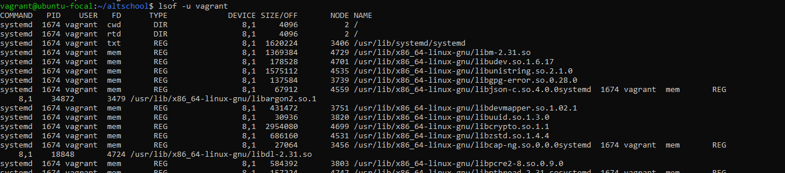
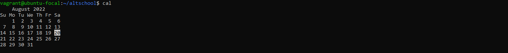

# 10 more linux commands
#### 1. Command `$lsof -u user`: This command is used to list files opened by (a particular)user.
          example: $lsof -u vagrant
          screenshot:
         
#### 2. Command `$w`: This command shows who is logged in and what they are doing.
          example: $w
          screenshot:
     
#### 3. Command `$hostname`: This command shows the system host name.
          example: $hostname
          screenshot:
   
#### 4. Command `$last reboot`: This command shows system reboot history.
          example: $last reboot
          screenshot:
   
#### 5. Command "$cal": This command shows this month's calendar.
          example: $cal
          screenshot:
             
#### 6. Command `$id`: This command displays the user and group ids of your current user.
          example: $id
          screenshot:  
    
#### 7. Command `$who`: This command shows who is logged into the system.
          example: $who
          screenshot:
           
#### 8. Command `$unset`: This command is used to remove a variable
          example: $unset dn
          screenshot:
           
#### 9. Command `$logout`: This command is used to logout of a vagrant ssh
          example: $logout
          screenshot:
           
#### 10. Command `$less`: This command is used to browse through a text file
          example: $less test2.txt
          screenshot:
              
